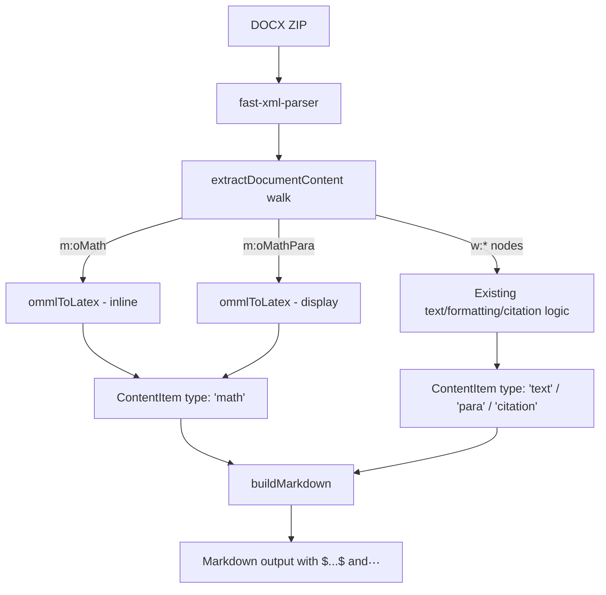

# Design Document: DOCX Equation Conversion

## Overview

This feature extends the existing DOCX-to-Markdown converter (`src/converter.ts`) to translate OMML (Office Math Markup Language) elements into LaTeX notation embedded in Markdown. The converter already handles WordprocessingML (`w:*`) elements for text, formatting, comments, citations, headings, and lists. This design adds a parallel OMML translation layer that integrates into the existing `walk()` traversal in `extractDocumentContent()` and emits LaTeX-wrapped content items that `buildMarkdown()` renders with `$...$` or `$$...$$` delimiters.

The approach is a recursive descent translator: each supported OMML element type maps to a pure function that returns a LaTeX string. The translator is self-contained in a new module `src/omml.ts`, keeping the existing converter code changes minimal (just dispatch hooks in the `walk()` function and delimiter logic in `buildMarkdown()`).

## Architecture



The XML parser (`fast-xml-parser` with `preserveOrder: true`) already produces the node structure used throughout the converter. OMML elements appear as `m:oMath` and `m:oMathPara` keys in the same parsed tree. The design reuses the existing parser configuration and node traversal patterns.

## Components and Interfaces

### 1. New Module: `src/omml.ts`

This module exports a single entry point and contains all OMML-to-LaTeX translation logic.

```typescript
// src/omml.ts

/**
 * Convert an OMML element's children to a LaTeX string.
 * This is the main entry point called from converter.ts.
 * 
 * @param children - The child nodes of an m:oMath or m:oMathPara element
 * @returns LaTeX string (without delimiters)
 */
export function ommlToLatex(children: any[]): string;
```

Internally, the module contains handler functions for each supported OMML construct:

```typescript
// Internal dispatch — not exported
function translateNode(node: any): string;      // dispatches by tag name
function translateFraction(children: any[]): string;     // m:f
function translateSuperscript(children: any[]): string;  // m:sSup
function translateSubscript(children: any[]): string;    // m:sSub
function translateSubSup(children: any[]): string;       // m:sSubSup
function translateRadical(children: any[]): string;      // m:rad
function translateNary(children: any[]): string;         // m:nary
function translateDelimiter(children: any[]): string;    // m:d
function translateAccent(children: any[]): string;       // m:acc
function translateMatrix(children: any[]): string;       // m:m
function translateFunction(children: any[]): string;     // m:func
function translateRun(children: any[]): string;          // m:r
function translateText(children: any[]): string;         // m:t text extraction
```

Helper functions:

```typescript
function getOmmlAttr(node: any, attr: string): string;  // attribute extraction for m:* namespace
function unicodeToLatex(char: string): string;           // Unicode → LaTeX command mapping
function escapeLatex(text: string): string;              // escape reserved LaTeX chars in text
function isMultiLetter(text: string): boolean;           // detect multi-letter runs for \mathrm{}
```

### 2. Changes to `src/converter.ts`

#### New ContentItem variant

```typescript
// Add to the ContentItem union type:
| { type: 'math'; latex: string; display: boolean }
```

- `latex`: the LaTeX string (without delimiters)
- `display`: `true` for `m:oMathPara` (block), `false` for `m:oMath` (inline)

#### Changes to `extractDocumentContent()` — `walk()` function

Add two new branches in the `walk()` function's key-dispatch loop:

```typescript
} else if (key === 'm:oMathPara') {
  // Display equation — extract m:oMath children from within
  const mathParaChildren = Array.isArray(node[key]) ? node[key] : [node[key]];
  const oMathNodes = mathParaChildren.filter((c: any) => c['m:oMath'] !== undefined);
  for (const oMathNode of oMathNodes) {
    const latex = ommlToLatex(oMathNode['m:oMath']);
    if (latex) {
      content.push({ type: 'math', latex, display: true });
    }
  }
} else if (key === 'm:oMath') {
  // Inline equation
  const mathChildren = Array.isArray(node[key]) ? node[key] : [node[key]];
  const latex = ommlToLatex(mathChildren);
  if (latex) {
    content.push({ type: 'math', latex, display: false });
  }
}
```

The `m:oMathPara` branch must appear before the `m:oMath` branch to prevent the generic array recursion from descending into math nodes as regular content. Empty math elements (empty LaTeX output) are skipped per Requirement 6.3.

#### Changes to `buildMarkdown()`

Add a handler for the `'math'` content item type:

```typescript
if (item.type === 'math') {
  if (item.display) {
    // Ensure blank line before $$
    if (output.length > 0 && !output[output.length - 1].endsWith('\n\n')) {
      output.push('\n\n');
    }
    output.push(`$$\n${item.latex}\n$$`);
    // The next para separator will add the blank line after
  } else {
    output.push(`$${item.latex}$`);
  }
  i++;
  continue;
}
```

### 3. Unicode-to-LaTeX Mapping Table

A static `Map<string, string>` in `src/omml.ts` mapping Unicode code points to LaTeX commands:

```typescript
const UNICODE_LATEX_MAP: Map<string, string> = new Map([
  // Greek lowercase
  ['α', '\\alpha'], ['β', '\\beta'], ['γ', '\\gamma'], ['δ', '\\delta'],
  ['ε', '\\epsilon'], ['ζ', '\\zeta'], ['η', '\\eta'], ['θ', '\\theta'],
  ['ι', '\\iota'], ['κ', '\\kappa'], ['λ', '\\lambda'], ['μ', '\\mu'],
  ['ν', '\\nu'], ['ξ', '\\xi'], ['π', '\\pi'], ['ρ', '\\rho'],
  ['σ', '\\sigma'], ['τ', '\\tau'], ['υ', '\\upsilon'], ['φ', '\\phi'],
  ['χ', '\\chi'], ['ψ', '\\psi'], ['ω', '\\omega'],
  // Greek uppercase
  ['Γ', '\\Gamma'], ['Δ', '\\Delta'], ['Θ', '\\Theta'], ['Λ', '\\Lambda'],
  ['Ξ', '\\Xi'], ['Π', '\\Pi'], ['Σ', '\\Sigma'], ['Φ', '\\Phi'],
  ['Ψ', '\\Psi'], ['Ω', '\\Omega'],
  // Operators and symbols
  ['×', '\\times'], ['÷', '\\div'], ['±', '\\pm'], ['∓', '\\mp'],
  ['≤', '\\leq'], ['≥', '\\geq'], ['≠', '\\neq'], ['≈', '\\approx'],
  ['∞', '\\infty'], ['∂', '\\partial'], ['∇', '\\nabla'],
  ['∈', '\\in'], ['∉', '\\notin'], ['⊂', '\\subset'], ['⊃', '\\supset'],
  ['∪', '\\cup'], ['∩', '\\cap'], ['→', '\\to'], ['←', '\\leftarrow'],
  ['⇒', '\\Rightarrow'], ['⇐', '\\Leftarrow'], ['↔', '\\leftrightarrow'],
  ['∀', '\\forall'], ['∃', '\\exists'], ['¬', '\\neg'],
  ['∧', '\\land'], ['∨', '\\lor'], ['⊕', '\\oplus'], ['⊗', '\\otimes'],
  ['·', '\\cdot'], ['…', '\\ldots'], ['⋯', '\\cdots'],
  // Add more as needed
]);
```

### 4. Accent Mapping Table

```typescript
const ACCENT_MAP: Map<string, string> = new Map([
  ['\u0302', '\\hat'],     // combining circumflex
  ['\u0305', '\\bar'],     // combining overline
  ['\u0307', '\\dot'],     // combining dot above
  ['\u0308', '\\ddot'],    // combining diaeresis
  ['\u030C', '\\check'],   // combining caron
  ['\u0303', '\\tilde'],   // combining tilde
  ['\u20D7', '\\vec'],     // combining right arrow above
  ['ˆ', '\\hat'],
  ['¯', '\\bar'],
  ['˙', '\\dot'],
  ['~', '\\tilde'],
  ['→', '\\vec'],
]);
```

### 5. N-ary Operator Mapping

```typescript
const NARY_MAP: Map<string, string> = new Map([
  ['∑', '\\sum'],
  ['∏', '\\prod'],
  ['∫', '\\int'],
  ['∬', '\\iint'],
  ['∭', '\\iiint'],
  ['∮', '\\oint'],
  ['⋃', '\\bigcup'],
  ['⋂', '\\bigcap'],
]);
```

### 6. Known Function Names

```typescript
const KNOWN_FUNCTIONS = new Set([
  'sin', 'cos', 'tan', 'cot', 'sec', 'csc',
  'arcsin', 'arccos', 'arctan',
  'sinh', 'cosh', 'tanh', 'coth',
  'log', 'ln', 'exp', 'lim', 'max', 'min',
  'sup', 'inf', 'det', 'dim', 'gcd', 'deg',
  'arg', 'hom', 'ker',
]);
```

## Data Models

### OMML XML Structure (as parsed by fast-xml-parser)

With `preserveOrder: true`, fast-xml-parser produces arrays of objects where each object has a single key (the tag name) whose value is an array of children. Attributes live under `:@`.

Example: `<m:f><m:num><m:r><m:t>a</m:t></m:r></m:num><m:den><m:r><m:t>b</m:t></m:r></m:den></m:f>`

Parses to:
```json
[{
  "m:f": [
    { "m:num": [{ "m:r": [{ "m:t": [{ "#text": "a" }] }] }] },
    { "m:den": [{ "m:r": [{ "m:t": [{ "#text": "b" }] }] }] }
  ]
}]
```

### OMML Element → LaTeX Translation Table

| OMML Element | Children | LaTeX Output |
|---|---|---|
| `m:f` | `m:num`, `m:den` | `\frac{num}{den}` |
| `m:sSup` | `m:e`, `m:sup` | `{base}^{sup}` |
| `m:sSub` | `m:e`, `m:sub` | `{base}_{sub}` |
| `m:sSubSup` | `m:e`, `m:sub`, `m:sup` | `{base}_{sub}^{sup}` |
| `m:rad` | `m:deg`, `m:e` | `\sqrt[deg]{e}` or `\sqrt{e}` |
| `m:nary` | `m:naryPr`, `m:sub`, `m:sup`, `m:e` | `\sum_{sub}^{sup}{e}` |
| `m:d` | `m:dPr`, `m:e` (one or more) | `(e1, e2, ...)` or `\left(...\right)` |
| `m:acc` | `m:accPr`, `m:e` | `\hat{e}` etc. |
| `m:m` | `m:mr` rows, each with `m:e` cells | `\begin{matrix}...\end{matrix}` |
| `m:func` | `m:fName`, `m:e` | `\sin{e}` or `\operatorname{name}{e}` |
| `m:r` | `m:rPr`, `m:t` | text content with Unicode mapping |

### ContentItem Extension

The existing `ContentItem` union type gains a new `'math'` variant:

```typescript
| { type: 'math'; latex: string; display: boolean }
```

This integrates cleanly with the existing `buildMarkdown()` switch on `item.type`.

### Translation Algorithm (Pseudocode)

```
function ommlToLatex(children):
  result = ""
  for each child node in children:
    for each key in node (skip ":@"):
      result += translateNode(key, node[key])
  return result.trim()

function translateNode(tag, children):
  switch tag:
    case "m:f":    return translateFraction(children)
    case "m:sSup": return translateSuperscript(children)
    case "m:sSub": return translateSubscript(children)
    ...
    case "m:r":    return translateRun(children)
    case "m:t":    return extractAndMapText(children)
    default:
      if tag starts with "m:" and is not a known property tag:
        return fallbackPlaceholder(tag, children)
      else:
        return ""  // skip property/control tags like m:rPr, m:ctrlPr
```

Each `translate*` function extracts the relevant child elements by tag name, recursively calls `ommlToLatex()` on their children, and composes the LaTeX string.


## Correctness Properties

*A property is a characteristic or behavior that should hold true across all valid executions of a system — essentially, a formal statement about what the system should do. Properties serve as the bridge between human-readable specifications and machine-verifiable correctness guarantees.*

The following properties were derived from the acceptance criteria after prework analysis and redundancy elimination. Individual construct-level criteria (3.1–3.15) are largely subsumed by the structural fidelity round-trip property (Property 4), which validates that the translator correctly handles all supported constructs compositionally.

### Property 1: Delimiter selection matches element type

*For any* OMML element, if the element is `m:oMath` (inline), the Markdown output SHALL contain the LaTeX wrapped in `$...$` delimiters; if the element is `m:oMathPara` (display), the output SHALL contain the LaTeX wrapped in `$$...$$` delimiters.

**Validates: Requirements 1.1, 2.1**

### Property 2: Display equations are separated by blank lines

*For any* document containing a display equation (`m:oMathPara`) with surrounding text content, the `$$...$$` block SHALL be preceded and followed by blank lines in the Markdown output.

**Validates: Requirements 2.2**

### Property 3: Balanced braces invariant

*For any* supported OMML tree of bounded depth and size, the LaTeX string produced by `ommlToLatex()` SHALL have balanced curly braces (every `{` has a matching `}`), and every `\left` SHALL have a matching `\right`.

**Validates: Requirements 5.2, 3.9**

### Property 4: Structural fidelity round-trip

*For any* generated OMML tree within the supported subset (fractions, superscripts, subscripts, sub-superscripts, radicals, n-ary operators, delimiters, accents, matrices, functions, math runs) of bounded depth and size, converting to LaTeX and re-parsing the LaTeX SHALL produce a structurally equivalent mathematical expression (same operator/function/operand tree shape, ignoring insignificant whitespace and equivalent delimiter sizing).

**Validates: Requirements 5.1, 3.1, 3.2, 3.3, 3.4, 3.5, 3.6, 3.7, 3.8, 3.10, 3.12, 3.13, 3.14, 3.15**

### Property 5: Unicode-to-LaTeX mapping correctness

*For any* character in the Unicode-to-LaTeX mapping table, when that character appears in an `m:t` text node, the converter SHALL emit the corresponding LaTeX command. *For any* character NOT in the mapping table, the converter SHALL emit the character unchanged.

**Validates: Requirements 4.1, 4.2, 4.3**

### Property 6: LaTeX escaping of reserved characters

*For any* text string containing reserved LaTeX characters (`#`, `$`, `%`, `&`, `_`, `{`, `}`, `~`, `^`, `\`) that appears as literal text content in an `m:r` math run, the converter SHALL escape those characters so the output is syntactically valid LaTeX.

**Validates: Requirements 4A.1, 4A.2**

### Property 7: Deterministic output

*For any* OMML input, calling the converter twice on identical input SHALL produce identical LaTeX output.

**Validates: Requirements 4A.4**

### Property 8: Mixed content preservation

*For any* paragraph containing both regular text runs (`w:r`/`w:t`) and inline math (`m:oMath`), the Markdown output SHALL contain both the original text content and the LaTeX-wrapped equation, in document order.

**Validates: Requirements 1.2, 3A.1**

### Property 9: Formatting and control node invariance

*For any* OMML tree, adding `w:rPr` formatting nodes or control nodes (`w:bookmarkStart`, `w:bookmarkEnd`, `w:proofErr`) inside or adjacent to math content SHALL NOT change the LaTeX output.

**Validates: Requirements 3A.3, 3A.4**

### Property 10: Fallback and continuation

*For any* document containing an unrecognized OMML element (tag not in the supported set), the converter SHALL emit a fallback placeholder containing the element name, AND subsequent valid content SHALL still be converted correctly.

**Validates: Requirements 6.1, 6.4, 3B.2**

### Property 11: Math run text handling

*For any* single-letter variable in an `m:r` math run, the converter SHALL emit it as-is (no wrapping). *For any* multi-letter text in an `m:r` math run, the converter SHALL wrap it in `\mathrm{...}` (unless it is a known function name or has specific styling).

**Validates: Requirements 3.14, 3A.2**

## Error Handling

### Fallback Placeholder Strategy

When the translator encounters an unsupported or malformed OMML element, it emits a visible placeholder rather than throwing:

```typescript
function fallbackPlaceholder(tag: string, children: any[]): string {
  const name = tag.replace('m:', '');
  // Extract any text content for context
  const textContent = extractAllText(children);
  const escaped = escapeLatex(textContent);
  return `\\text{[UNSUPPORTED: ${name}]${escaped ? ' ' + escaped : ''}}`;
}
```

### Error Scenarios

| Scenario | Behavior |
|---|---|
| Unrecognized `m:*` element | Emit `\text{[UNSUPPORTED: element_name]}` with escaped text content |
| Missing required child (e.g., `m:f` without `m:num`) | Emit `\text{[UNSUPPORTED: f]}` — treat as malformed |
| Empty `m:oMath` / `m:oMathPara` | Skip entirely — no delimiters emitted |
| Unknown accent character | Emit `\text{[UNSUPPORTED: acc]}` with base content |
| Unknown n-ary operator character | Emit the Unicode character directly as the operator |
| Deeply nested structure (>50 levels) | Existing `findAllDeep` maxDepth pattern; translator uses recursion with bounded input |

### Non-Fatal Design

The translator never throws exceptions. Every `translate*` function returns a string (possibly a fallback placeholder). The `walk()` function in `extractDocumentContent()` catches any unexpected errors from `ommlToLatex()` and emits a fallback content item, ensuring document conversion always completes.

```typescript
// In walk(), wrapping the ommlToLatex call:
try {
  const latex = ommlToLatex(mathChildren);
  if (latex) {
    content.push({ type: 'math', latex, display: false });
  }
} catch {
  content.push({ type: 'math', latex: '\\text{[EQUATION ERROR]}', display: false });
}
```

## Testing Strategy

### Dual Testing Approach

This feature uses both unit tests and property-based tests:

- **Unit tests**: Verify specific OMML-to-LaTeX translations for each construct type, edge cases (empty elements, missing children, unknown elements), and end-to-end DOCX conversion with math content.
- **Property-based tests**: Verify universal correctness properties across randomly generated OMML trees using `fast-check`.

### Property-Based Testing Configuration

- **Library**: `fast-check` (already a devDependency)
- **Runtime**: `bun test`
- **Minimum iterations**: 100 per property (per AGENTS.md guidance, use bounded generators to avoid timeouts)
- **Tag format**: `Feature: docx-equation-conversion, Property N: {title}`

Each correctness property from the design maps to a single property-based test. The test file will be `src/omml.test.ts`.

### OMML Tree Generator Strategy

A custom `fast-check` `Arbitrary` generates random OMML trees within the supported subset:

```typescript
// Bounded OMML tree generator
const ommlTree = (maxDepth: number): fc.Arbitrary<any[]> =>
  fc.letrec(tie => ({
    tree: fc.oneof(
      { depthSize: 'small' },
      mathRun(),           // m:r with m:t text
      fraction(tie),       // m:f with m:num, m:den
      superscript(tie),    // m:sSup
      subscript(tie),      // m:sSub
      radical(tie),        // m:rad
      delimiter(tie),      // m:d
      // ... other constructs
    ),
  })).tree.map(node => [node]);
```

Key constraints (from AGENTS.md learnings):
- Use `maxDepth` parameter to bound tree depth (recommend 3–4)
- Use short bounded string generators for text content (`fc.string({ minLength: 1, maxLength: 10 })`)
- Filter generated strings to avoid characters that would make round-trip comparison ambiguous

### Test Organization

```
src/omml.ts          — OMML-to-LaTeX translation module
src/omml.test.ts     — Unit tests + property-based tests for omml.ts
src/converter.test.ts — Extended with integration tests for math content items
```

### Property Test → Design Property Mapping

| Test | Design Property | Requirements |
|---|---|---|
| Property test 1 | Property 1: Delimiter selection | 1.1, 2.1 |
| Property test 2 | Property 2: Display blank lines | 2.2 |
| Property test 3 | Property 3: Balanced braces | 5.2, 3.9 |
| Property test 4 | Property 4: Structural fidelity | 5.1, 3.1–3.15 |
| Property test 5 | Property 5: Unicode mapping | 4.1, 4.2, 4.3 |
| Property test 6 | Property 6: LaTeX escaping | 4A.1, 4A.2 |
| Property test 7 | Property 7: Deterministic output | 4A.4 |
| Property test 8 | Property 8: Mixed content | 1.2, 3A.1 |
| Property test 9 | Property 9: Node invariance | 3A.3, 3A.4 |
| Property test 10 | Property 10: Fallback + continuation | 6.1, 6.4, 3B.2 |
| Property test 11 | Property 11: Math run text | 3.14, 3A.2 |

### Unit Test Coverage

Unit tests cover:
- Each OMML construct individually (fraction, superscript, subscript, etc.)
- Empty math elements (Req 6.3)
- Missing children / malformed elements (Req 6.2)
- Unknown OMML elements (Req 6.1)
- Unicode Greek letters and math symbols
- Multi-letter vs single-letter math runs
- End-to-end DOCX with equations (integration)
